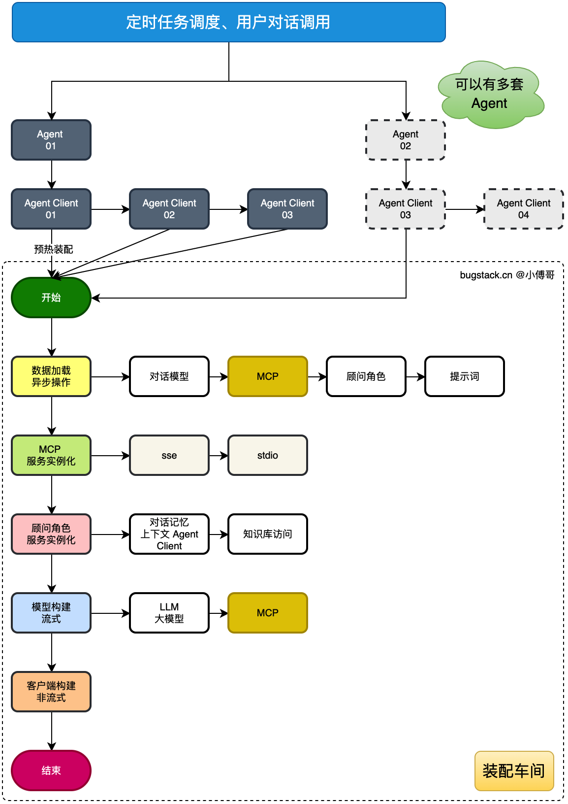

# Graph of Project



这张架构图挺重要的，可以引申出很多问题出来

项目对应的代码仓库是<https://github.com/ChillSniper/ai-agent-station>(private)

有一点我还是蛮感慨的，他这个Project实际上还是挺不错的，但我不明白为什么他的文档总是写的和勾石一样。

所以学习Project的最好方式是直接打开IDEA or vscode，然后去阅读源码，不懂的就问AI，照着他课程的目录大纲学就OK了。

---

## DDD 架构分层详解

### 项目模块结构

```java
ai-agent-station/
├── ai-agent-station-api/          # 接口定义层
├── ai-agent-station-app/          # 应用启动层
├── ai-agent-station-domain/       # 领域核心层（业务逻辑）
├── ai-agent-station-trigger/      # 触发器层（控制器）
├── ai-agent-station-infrastructure/ # 基础设施层（数据访问）
├── ai-agent-station-types/        # 通用类型定义
└── docs/                          # 文档和部署脚本
```

### DDD 分层架构原理

**数据流向：** `trigger → domain → infrastructure`
**依赖原则：** 外层依赖内层，内层不依赖外层

---

### 1. api 层 - 接口契约定义

**作用：** 定义对外暴露的接口契约

**为什么只有几个接口？**

- 这个项目更注重内部架构，对外只暴露少量核心接口
- 不是所有功能都需要对外暴露

**核心接口（IAiAgentService.java）：**

```java
public interface IAiAgentService {
    Response<Boolean> preheat(Long aiClientId);                    // 预热 Agent（提前加载配置）
    Response<String> chatAgent(Long aiAgentId, String message);    // 同步对话
    Flux<ChatResponse> chatStream(Long aiAgentId, Long ragId, String message); // 流式对话（SSE）
    Response<Boolean> uploadRagFile(String name, String tag, List<MultipartFile> files); // 上传知识库文件
}
```

**这些接口是给外部调用的契约**，trigger 层的 Controller 会实现这些接口。

---

### 2. app 层 - 应用启动和配置

**作用：** 应用启动入口 + 各种配置类

**为什么都是 Config？**

- 这一层就是专门做配置的，不包含业务逻辑
- 相当于房子装修前的水电网络配置

**核心配置类：**

#### AiAgentConfig.java - 核心配置

```java
@Configuration
public class AiAgentConfig {
    // 1. 数据源配置（MySQL + PostgreSQL 双数据源）
    @Bean("mybatisDataSource") - MyBatis 使用的 MySQL 数据源
    @Bean("pgVectorDataSource") - PgVector 向量数据库数据源

    // 2. PgVector 向量数据库配置（用于 RAG 知识库）
    @Bean("vectorStore") - 向量存储

    // 3. OpenAI Embedding 配置（文本向量化）
    OpenAiEmbeddingModel embeddingModel

    // 4. 文本分割器
    @Bean TokenTextSplitter tokenTextSplitter()
}
```

#### 其他配置类

- `AsyncConfiguration.java` - 异步线程池配置
- `ThreadPoolConfig.java` - 自定义线程池
- `GuavaConfig.java` - Guava 缓存配置

---

### 3. domain 层 - 领域核心层（业务逻辑）

**作用：** 整个项目的核心，包含所有业务逻辑

**是 Service + Model 吗？**

- 是的！这是 DDD 的核心层

#### Service（服务）

```java
domain/agent/service/
├── IAiAgentChatService          # 对话服务接口
│   └── chat/AiAgentChatService  # 对话服务实现
├── IAiAgentRagService           # 知识库服务接口
│   └── rag/AiAgentRagService    # 知识库服务实现
├── IAiAgentPreheatService       # 预热服务接口
│   └── preheat/AiAgentPreheatService # 预热服务实现
└── IAiAgentTaskService          # 定时任务服务接口
    └── task/AiAgentTaskService  # 定时任务服务实现
```

#### Model（模型）

```java
domain/agent/model/
├── valobj/          # 值对象（VO）
│   ├── AiClientModelVO.java
│   ├── AiClientToolMcpVO.java
│   ├── AiRagOrderVO.java
│   └── ...
├── entity/          # 实体对象
│   └── AiAgentEngineStarterEntity.java
└── aggregate/       # 聚合根
```

**重点：** domain 层只关注业务逻辑，不关心：

- 数据怎么存储（不依赖 infrastructure）
- 请求怎么接收（不依赖 trigger）

---

### 4. trigger 层 - 触发器层（外部入口）

**作用：** 外部触发业务的入口

**包含什么？**

- Controller（HTTP 接口）
- Job（定时任务）
- Listener（事件监听器）

#### Controller（HTTP 接口）

**业务接口 - AiAgentController.java**:

```java
@RestController
@RequestMapping("/api/v1/ai/agent/")
public class AiAgentController implements IAiAgentService {
    @Resource
    private IAiAgentChatService aiAgentChatService;

    @RequestMapping(value = "chat_agent", method = RequestMethod.GET)
    public Response<String> chatAgent(@RequestParam("aiAgentId") Long aiAgentId,
                                      @RequestParam("message") String message) {
        String content = aiAgentChatService.aiAgentChat(aiAgentId, message);
        return Response.success(content);
    }
}
```

**管理接口 - AiAdminClientToolMcpController.java**:

```java
@RestController
@RequestMapping("/api/v1/ai/admin/client/tool/mcp/")
public class AiAdminClientToolMcpController {
    @Resource
    private IAiClientToolMcpDao aiClientToolMcpDao; // 直接注入 DAO

    // MCP 工具的增删改查
    @RequestMapping(value = "queryMcpList", method = RequestMethod.POST)
    public ResponseEntity<List<AiClientToolMcp>> queryMcpList(...)
}
```

**为什么 Admin Controller 直接调用 DAO？**

- 后台管理接口（Admin）是简单的 CRUD 操作
- 不需要复杂的业务逻辑，可以直接操作数据库
- 遵循"够用就好"的原则，避免过度设计

#### Job（定时任务）

```java
trigger/job/
└── AgentTaskJob.java  # 定时执行 Agent 任务
```

#### Listener（事件监听器）

- 监听消息队列
- 监听事件总线

**类比：** trigger = 遥控器按钮，按了就触发业务逻辑

---

### 5. infrastructure 层 - 基础设施层（数据访问）

**作用：** 数据访问层（DAO + PO）

**这是独立的微服务吗？**

- 不是！这只是普通的数据访问层
- 包含 MyBatis Mapper 接口和持久化对象

**包含什么？**

```java
infrastructure/
├── dao/              # MyBatis Mapper 接口
│   ├── IAiClientToolMcpDao.java
│   ├── IAiClientModelDao.java
│   └── ...
├── po/               # 持久化对象（数据库表映射）
│   ├── AiClientToolMcp.java
│   ├── AiClientModel.java
│   └── ...
└── redis/            # Redis 操作
```

**示例：**

```java
// trigger 层的 Controller 直接注入 infrastructure 层的 DAO
@RestController
public class AiAdminClientToolMcpController {
    @Resource
    private IAiClientToolMcpDao aiClientToolMcpDao;

    public ResponseEntity<List<AiClientToolMcp>> queryMcpList(...) {
        List<AiClientToolMcp> mcpList = aiClientToolMcpDao.queryMcpList(...);
        return ResponseEntity.ok(mcpList);
    }
}
```

---

### 6. types 层 - 通用类型定义

**作用：** 定义全局通用的类型、常量、枚举、异常

**包含什么？**

```java
types/
├── common/
│   └── Constants.java      # 常量定义
├── exception/
│   └── AppException.java   # 自定义异常
└── enums/                  # 枚举类
```

---

## 请求流程示例

**场景：用户通过前端发起 AI 对话**:

```java
1. 用户请求：GET /api/v1/ai/agent/chat_agent?aiAgentId=1&message=你好

2. trigger 层接收：AiAgentController.chatAgent()
   ↓
3. 调用 domain 层：aiAgentChatService.aiAgentChat()
   ↓
4. domain 层执行业务逻辑：
   - 加载 Agent 配置
   - 调用 OpenAI API
   - 整合 MCP 工具
   ↓
5. infrastructure 层查询数据：
   - 从 MySQL 读取配置
   - 从 PgVector 读取知识库
   ↓
6. 返回结果给用户
```

---

## 关键点总结

| 层级               | 职责             | 常见疑问                         | 答案                        |
| ------------------ | ---------------- | -------------------------------- | --------------------------- |
| **api**            | 定义对外接口契约 | 为什么只有几个接口？             | 对外只暴露核心功能          |
| **app**            | 启动和配置       | 为什么都是 Config？              | 这层就是专门干配置的        |
| **domain**         | 核心业务逻辑     | 是 Service + Model 吗？          | 是的！这是 DDD 核心层       |
| **trigger**        | 外部触发入口     | Controller/Job/Listener 是什么？ | HTTP 接口/定时任务/事件监听 |
| **infrastructure** | 数据访问         | 是独立的微服务吗？               | 不是，就是 DAO 数据访问层   |
| **types**          | 通用类型定义     | -                                | 常量、枚举、异常            |

---

## 快速上手建议

1. **先看 trigger/AiAgentController** - 理解对外接口
2. **再看 domain/service** - 理解核心业务逻辑
3. **最后看 infrastructure/dao** - 理解数据结构

**学习顺序：**

```java
外→内：trigger → domain → infrastructure  (理解流程)
内→外：domain → infrastructure → trigger  (设计思路)
```
